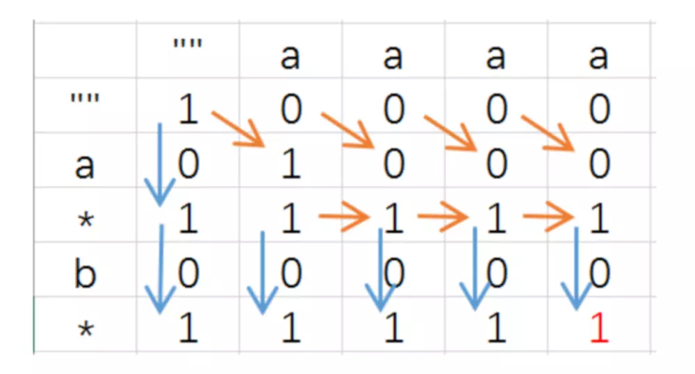

# [10. Regular Expression Matching](https://leetcode.com/problems/regular-expression-matching/)

## 2019/02/22

### 题目 💗

正则表达式匹配,很难但是必考题,一定要会,采用**动态规划**的思路也就是 dp...

<!-- > #### 思路
> 采用dp思想去解决问题
> `mississippi`
> `mis*is*ip*.`
> 匹配一次就消耗
> s 经过三次消耗策略  自上而下的动态规划消耗策略 每次消耗,只返回消耗最多的策略,`mis*`  `is*`  `ip*`
>
> --------------
>
> 1. for 循环 (mis*) 第一次组合消耗策略, 并返回min(最短长度的s)
> s 经过 (mis*) 消耗策略
> s 经过 (m)(is*) 消耗策略
> s 经过 (mi)(s*) 消耗策略
>
> --------------
>
> 2. for 循环 (is*) 第二次组合消耗策略, 并返回min(最短长度的s)
> s 经过 (is*) 消耗策略
> s 经过 (i)(s*) 消耗策略
>
> --------------
>
> 3. for 循环 (ip*) 第二次组合消耗策略, 并返回min(最短长度的s)
> s 经过 (ip*) 消耗策略
> s 经过 (i)(p*) 消耗策略
>
> --------------
>
> s 如果经过上面三次消耗,("结果"==""?true:false) -->

### TODO

- [x] 测试用例通过
- [x] 双层 for 循环遍历一般都很慢,应该尽量避免写 O(m\*n)代码
- [x] 了解什么是[动态规划](../dynamic-programing/README.md)
- [ ] 回溯法可以解决这题
- [ ] 动态规划同样可以解决这道题目

### 😂 有待纠正的错误

自己乱写,根本写不粗来...

```go
package isMatch

import (
  "fmt"
  "strings"
)

type description struct {
  val   string
  index int
}

// 包括`.`检测目标字符串是否匹配
func isMatchIncludeDot(s, p string) bool {
  if len(p) > len(s) {
    return false
  }
  for i := range p {
    _p := p[i : i+1]
    if _p != "." && s[i:i+1] != _p {
      return false
    }
  }
  return true
}

// 字符串匹配消耗
// s: aa -> p: a  匹配消耗策略: 贪婪匹配
func consume(s, p string) string {
  fmt.Println(s, p)
  if p == "*" {
    return s
  }
  if strings.Index(p, "*") > -1 {
    // 整个匹配无法消耗,尝试分割匹配
    // ppp pp* 优先采用分割匹配策略
    // if len(p)>1 && len(s)>len(p)-1 {
    //   return consume
    // }
    // 无限匹配策略
    ss := s
    for isMatchIncludeDot(ss, p[:len(p)-1]) == true {
      ss = ss[len(p)-1:]
    }
    return ss
  } else {
    if len(s) < len(p) {
      return s
    }
    // 对比两个字符串是否相等, 遇到 `.` 通配符
    for i := range p {
      _p := p[i : i+1]
      if _p != "." && s[i:i+1] != _p {
        return s
      }
    }
    return s[len(p):]
  }
}

// 返回当前匹配需要消除的字符串
func getMatch(s string) description {
  // mississippi
  // mis*is*ip*.
  // 匹配关键字符:
  // 匹配策略,
  // 字符串匹配不做消耗,
  // 字符串* 消耗一次
  indexStar := strings.Index(s, "*")
  if indexStar == -1 {
    return description{
      val:   s,
      index: len(s),
    }
  }
  // 匹配字符串模式
  return description{
    // 值
    val: s[:indexStar+1],
    // 模式
    index: indexStar + 1,
  }
}

func isMatch(s string, p string) bool {
  // 采用成功匹配就销项的策略
  //
  for len(p) > 0 && len(s) > 0 {
    description := getMatch(p)
    p = p[description.index:]
    s = consume(s, description.val)

    fmt.Printf("要被消耗的字符串: %s\t 剩余字符串: %s\n", description.val, p)
    fmt.Println("===========================================================", s)
  }
  fmt.Println("===========================================================")
  return len(s) == 0
}
```

自己写根本不可能写出来啊, 除非我创造一个动态规划,这可能么??

#### 其他相同的题目

运用这种解题思路,可以解决 leetcode 中四道 hard 题目,

[**Regular Expression Matching**](https://leetcode.com/problems/regular-expression-matching/description).

[**Wildcard Matching**](https://leetcode.com/problems/wildcard-matching/description/)

[**Interleaving String**](https://leetcode.com/problems/interleaving-string/description/)

[**Distinct Subsequences**](https://leetcode.com/problems/distinct-subsequences/description/)

#### 将结题题转换成对于 dp 图标的解读



- 非`*`
  - 直接对比是否相等
- 是`*`
  - 左边,如果前一个\*是可递推到的,则当前正则字符串可以直接被消耗掉,
  - 上边,如果上一个是相等字符串,当然可以匹配 n 次了,
  - 上上边,如果上上边可以递推到,那么当前正则表达式直接匹配 0 次,直接被消耗了

`aaaa`与`a*b*`转换成 dp 图标,从而将解题变成查询`dp[i][j]==true`进而判断是否匹配,总的来说动态规划对比两个是否相等,就是将其转化成二维图标,然后从左上角开始递推

上面说到`aaaa`与`a*b*` 它最开始是通过第二种情况递推得到的,然后重复匹配,利用第一种情况进行递推,图标如下

```bash
如果下一个是* 执行下面的
任意一个 true 就是 true
=========
0       ➡ i
  x x x
  x x x
* x x ?
⬇
j
=========
0       ➡ i
  x x m
  x x m
* x m 1
j
=========
```
